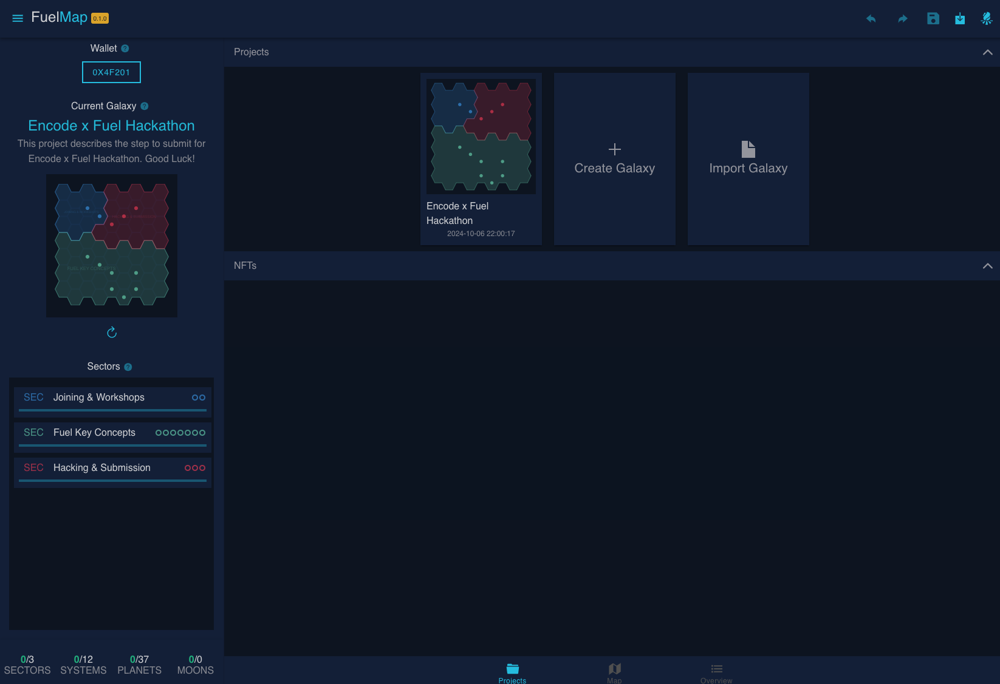
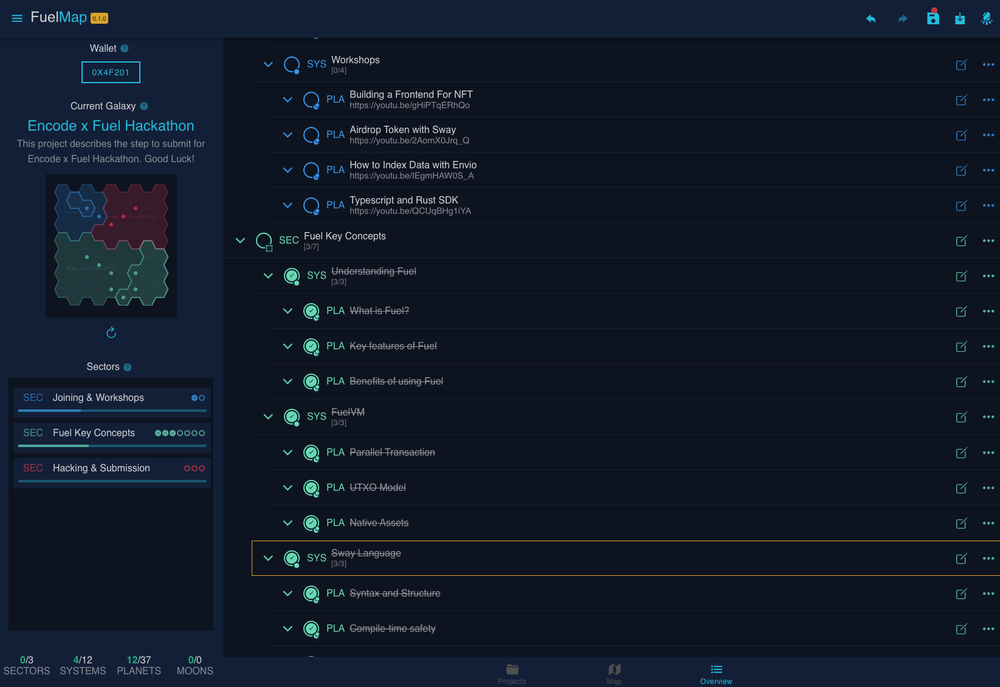
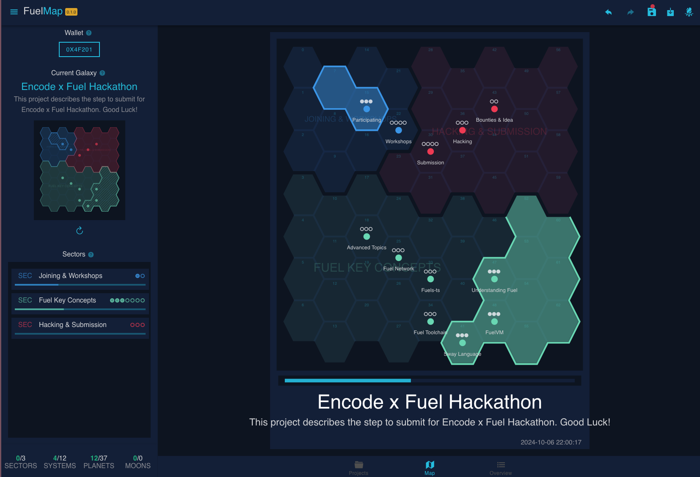
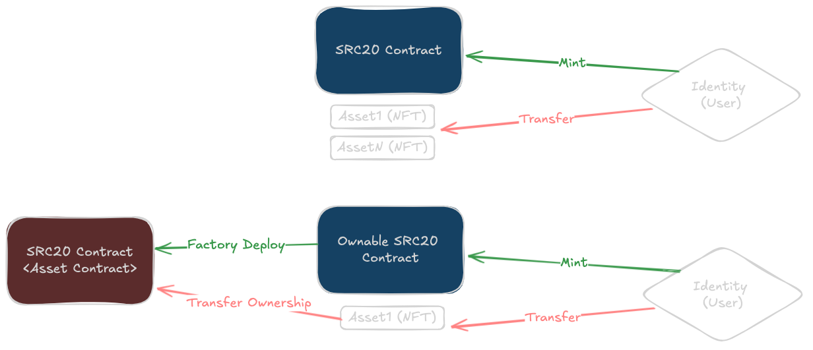

# [FuelMap] Ownable NFTs as NativeAssets Contracts: A Glorified Progress bar as a Space Map

**TLDR**: FuelMap is basically a todo app that allows the user to follow his progress on a project as a space map with territories representing his progress. These maps are NFTs.

This project for the **Encode x Fuel Hackathon** introduces three novel ideas:
- **Ownable NFT**: NFTs are not only Native Assets, but they are also ownable contracts where the holder of the nft can modify its values.
- **Instantialbe NFTs**: NFTs can be 'instantiated' from an existing NFT. eg. a map NFT produced by user A can be 'copied' by user B (given some fee) where user B can also follow his progress on the same project.
- **Community Interaction**: Users can comment on the nfts (given some fee) and their comments are recorded in the fuel chain logs.

## Links

- [Demo Video]()

## Table of Content

- [How it works](#how-it-works)
- [Known Issues](#known-issues)
- [Roadmap](#roadmap)

## How it works

### General Ownable NFT Idea

NFTs are generally implemented using the `SRC20` standard in fuel, they are represented as some metadata (link to an image, a list of attributes, etc.). Given the cheap fees, a new paradigm can be added to the way NFTs are stored and interacted with on chain.

In this project, NFTs are themselves smart-contracts. This allows for a large array of use cases. However, in order for this idea to work, the concept of `ownership` needs to be redefined: **Owning an NFT Asset = Owning the underlying contract**.

When an NFT asset is minted, a contract is created with the owner being the minter. When an NFT is sold or transferred, the ownership of the underlying can be also transferred (using a little bit of hack given that asset transfers on fuel happen regardless of any contract).

### FuelMap: Glorified Progress Bar as a Space Map

Mnemofy is a simple todo app that displays the progress as a space map with territories, the more todos you finish the bigger the territory you control. You can then generate a smart-contract NFT representing your todo project. As you advance in completing your project, you can create snapshots of your progress. You can then view your progress through the snapshots in the NFT contract.

The resulting NFT functions the same way as any SRC20/ERC721 NFT, the added value is that now you can have snapshots inside these NFTs!

Your todos should be structured as follows:

- **Sectors** are the general domain (they are represented as a territory).
- **Systems** are children of sectors (they are represented as a star inside a territory).
- **Planets** are children of systems (they are represented as dots on top of each system).
- **Moons** are children of planets (they are not represented yet in the space map)

## Known Issues

Unfortunatly, this project is still in its early version and multiple bugs have been identified:

- Buggy navigation using keyboard.
- Adding a sub task can sometimes fail randomly.
- SVG generation from the NFT is not complete.
- Loading and detection of wallet owned NFT sometimes fails to retrieve all NFTs of a connected wallet.
- ...

## Roadmap

- 2024Q4: Have a working version with basic map editing functionnalities.
- 2025Q1: Add Space Map themes & public launch
